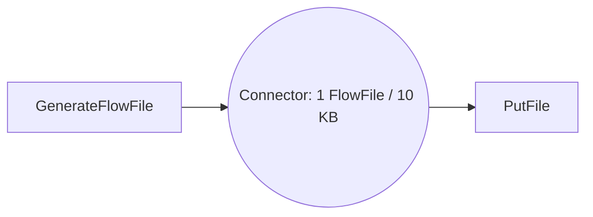
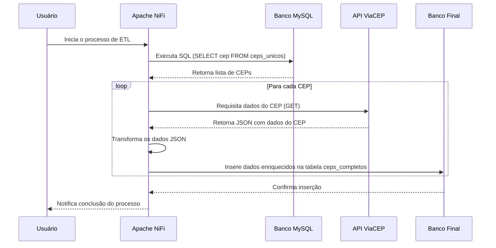

# **Apache NiFi**

---

## **O que é o Apache NiFi**
Apache NiFi é uma plataforma de automação e integração de fluxo de dados que permite mover e transformar dados entre diversos sistemas de forma segura e eficiente, com uma interface visual intuitiva.

---

## **História do Apache NiFi**
Originalmente criado pela NSA sob o nome Niagarafiles, o NiFi foi liberado como open-source pela Apache Software Foundation em 2014. Desde então, se tornou uma ferramenta essencial para integração de dados em tempo real e automação de processos em grandes volumes de dados.

---

## **Conectores e Integrações**
- **Cloud:** AWS S3, Azure Blob Storage, Google Cloud Storage  
- **Bancos de Dados:** MySQL, PostgreSQL, Oracle  
- **Mensageria:** Apache Kafka, MQTT, JMS  
- **APIs:** RESTful, FTP/SFTP, HDFS

---

## **Vantagens do Apache NiFi**
- **Interface visual:** Criação fácil de fluxos com arrastar e soltar  
- **Rastreamento completo:** Proveniência de dados para auditoria  
- **Escalável:** Funciona standalone ou em clusters  
- **Segurança robusta:** Suporte a SSL/TLS e autenticação por usuário único ou LDAP

---

## **Empresas que utilizam o Apache NiFi**
- **Netflix:** Processamento de logs  
- **ING Bank:** Integração de sistemas financeiros  
- **US Air Force:** Monitoramento operacional  
- **CERN:** Análise de dados científicos  

---

### **Passo a Passo para Rodar a Instância**

#### **1. Baixe a Imagem Oficial**
```bash
docker pull apache/nifi:latest
```

#### **2. Execute o Contêiner**
```bash
docker run --name nifi -p 8443:8443 -d apache/nifi:latest
```
- Acesse a interface web em: **[https://localhost:8443/nifi](https://localhost:8443/nifi)**  
- Por padrão, o NiFi gera um nome de usuário e senha aleatórios.

#### **3. Verificar Credenciais**
Use o comando abaixo para visualizar as credenciais geradas:
```bash
docker logs nifi | grep Generated
```

- Exemplo de saída dos logs:
  ```
  Generated Username [USERNAME]
  Generated Password [PASSWORD]
  ```

#### **4. (Opcional) Defina Credenciais Customizadas**
Você pode definir um nome de usuário e senha específicos com o comando:
```bash
docker run --name nifi -p 8443:8443 -d \
  -e SINGLE_USER_CREDENTIALS_USERNAME=admin \
  -e SINGLE_USER_CREDENTIALS_PASSWORD=your_secure_password \
  apache/nifi:latest
```
> **Nota:** A senha deve ter pelo menos 12 caracteres, caso contrário, o NiFi gerará credenciais aleatórias.

---

## **Comandos Docker úteis**

- **Parar o contêiner:**
  ```bash
  docker stop nifi
  ```

- **Reiniciar o contêiner:**
  ```bash
  docker restart nifi
  ```

- **Ver logs:**
  ```bash
  docker logs nifi
  ```

- **Entrar no contêiner:**
  ```bash
  docker exec -it nifi /bin/bash
  ```

## **Hello World: Processo com FlowFile no Apache NiFi usando Docker e Volumes**

Vamos criar um processo simples no **NiFi** utilizando o **GenerateFlowFile** para gerar arquivos de 10KB com conteúdo personalizado, simulando dados da **Jornada de Dados**. Além disso, usaremos o **PutFile** para salvar esses arquivos em um diretório local no host, configurando corretamente o volume no **Docker**.

### **Fluxo de Exemplo com GenerateFlowFile e PutFile**


1. **GenerateFlowFile**: Gera arquivos de 10KB a cada 10 segundos com o texto "Bem-vindo à Jornada de Dados!".
2. **Funnel**: Direciona a saída para o **PutFile**.
3. **PutFile**: Salva os arquivos gerados no diretório `/data`, que corresponde ao diretório `Temp` no host.

---

### **Executando o Apache NiFi com Docker e Volume Mapeado**

Para que o **PutFile** salve os arquivos no sistema local, configuraremos um volume Docker que mapeia um diretório local para o container do NiFi.

#### **Comando Docker com Volume:**

```bash
docker run --name nifi -p 8443:8443 -v C:/Temp/nifi-data:/data -d apache/nifi:latest
```

- **`-p 8443:8443`**: Expondo a interface do NiFi.
- **`-v C:/Temp/nifi-data:/data`**: Mapeia o diretório local para o diretório `/data` no container. Todos os arquivos gerados pelo **PutFile** serão salvos em `Temp` no host.
- **`-d`**: Executa o container em modo **daemon** (segundo plano).

---

### **Configuração do GenerateFlowFile**

#### **Settings:**
- **Name:** `Geração de Arquivo - Jornada de Dados`
- **Penalidade:** `30s` (Tempo de espera após falha)
- **Concurrent Tasks:** 1

#### **Scheduling:**
- **Run Schedule:** A cada 10 segundos.
- **Execution:** Timer Driven.

#### **Properties:**
- **File Size:** `10 KB`
- **Custom Text:** `"Bem-vindo à Jornada de Dados!"`
- **Batch Size:** `1` (Um arquivo por execução)

#### **Comments:**
- **Comentário:**  
  “Este processo gera arquivos de 10KB com uma mensagem personalizada da Jornada de Dados para testes e validação.”

---

### **Configuração do PutFile**

#### **Settings:**
- **Name:** `Salvar Arquivo na Pasta Local`

#### **Properties:**
- **Directory:** `/data`  
  (Esse é o diretório mapeado no container que corresponde ao diretório `nifi-data` no host.)
- **Conflict Resolution Strategy:** `replace` (Substituir arquivos com o mesmo nome.)
- **Create Missing Directories:** `true` (Criar diretórios ausentes se necessário.)
- **Permissions:** `rw-r--r--` (Definição de permissões para os arquivos gerados.)

---

### **Como o Processo Funciona**

1. O **GenerateFlowFile** cria arquivos de 10KB com a mensagem personalizada da Jornada de Dados.
2. Esses arquivos são enviados para o **Funnel**, que os direciona para o **PutFile**.
3. O **PutFile** salva os arquivos gerados no diretório `/data` no container, que está mapeado para `nifi-data` no host.

---

### **Conclusão**

Este exemplo mostra como criar e configurar um fluxo simples no **Apache NiFi**, utilizando **GenerateFlowFile** e **PutFile** para gerar e salvar arquivos com conteúdo personalizado. O uso de volumes no **Docker** permite que os arquivos criados no container fiquem acessíveis no host, facilitando testes e validações.

## Connectors

### **Configurações do Connector no Apache NiFi**

Aqui está uma explicação detalhada de cada configuração disponível ao configurar um **Connector** entre processadores no Apache NiFi. O Connector garante o fluxo controlado dos **FlowFiles** entre processadores, permitindo que você personalize o comportamento do fluxo de acordo com as necessidades do seu projeto.

---

### **Configurações do Connector: Parâmetros Explicados**

1. **Name (Nome):**  
   - Nome para o Connector que ajuda a identificá-lo facilmente na interface.
   - **Exemplo:** `Connector - Generate to PutFile`.

2. **ID:**  
   - Identificador único gerado automaticamente pelo NiFi. 
   - Usado internamente para rastreamento e referência.

   **Exemplo:** `c7b6a26d-0192-1000-b113-dbba3647b2a3`

3. **FlowFile Expiration (Expiração do FlowFile):**  
   - Define o tempo máximo que um FlowFile pode permanecer na fila antes de ser descartado.
   - **Padrão:** `0 sec` (Sem expiração).
   - **Quando usar:** Se quiser evitar que dados antigos se acumulem.

4. **Back Pressure (Pressão Reversa):**  
   - Controla quando o fluxo de dados deve ser pausado para evitar sobrecarga.

   - **Object Threshold (Limite de Objetos):**  
     - O número máximo de FlowFiles permitidos na fila antes de ativar o back pressure.
     - **Padrão:** `10.000` FlowFiles.

   - **Size Threshold (Limite de Tamanho):**  
     - O tamanho máximo de dados permitidos na fila.
     - **Padrão:** `1 GB`.

5. **Load Balance Strategy (Estratégia de Balanceamento de Carga):**  
   - Define como os FlowFiles serão distribuídos, especialmente útil em ambientes de **cluster**.

   **Opções:**
   - **Do not load balance:** (Padrão) Não há balanceamento de carga.
   - **Round Robin:** Distribui FlowFiles de forma alternada entre conexões ou nós.
   - **Single Node:** Todos os FlowFiles são enviados para um nó específico.
   - **FlowFile Attribute:** O balanceamento é feito com base em um atributo do FlowFile.

6. **Available Prioritizers (Priorizadores Disponíveis):**  
   - Determina a **ordem de processamento** dos FlowFiles na fila.

   **Opções:**
   - **FirstInFirstOutPrioritizer (FIFO):** Processa na ordem de chegada.
   - **NewestFlowFileFirstPrioritizer:** Prioriza os FlowFiles mais recentes.
   - **OldestFlowFileFirstPrioritizer:** Prioriza os FlowFiles mais antigos.
   - **PriorityAttributePrioritizer:** Usa um atributo específico do FlowFile para priorização.

7. **Selected Prioritizers (Priorizadores Selecionados):**  
   - Aqui você escolhe quais priorizadores serão aplicados à fila do Connector.
   - **Exemplo:** Selecione **FIFO** para manter a ordem de chegada dos FlowFiles.

---

### **Alterando o Connector para Apagar Fila a cada 10 Segundos**

#### **Passo a Passo: Alterando o Connector**

1. **Configuração no Connector:**
   - **Object Threshold:** `1`  
     (Permite apenas 1 FlowFile por vez na fila).
   - **Size Threshold:** `10 KB`  
     (Define o tamanho máximo para evitar sobrecarga).

---

### **Fluxo Ajustado: GenerateFlowFile → PutFile**



---

### **Conclusão**

Com essa configuração, o **Connector** limita o fluxo para que apenas **um FlowFile** seja processado a cada 10 segundos, controlando a frequência de processamento. O ajuste do **back pressure** garante que o fluxo se mantenha estável, enquanto o uso de **FIFO** como priorizador mantém a ordem de chegada dos arquivos.

## **Processor Groups no Apache NiFi**

Os **Processor Groups** são unidades lógicas que organizam e agrupam processadores no NiFi, facilitando a criação de fluxos modulares e gerenciáveis. 

### **Vantagens:**
- **Modularidade:** Divide fluxos complexos em partes menores.
- **Reutilização:** Pode ser duplicado ou exportado.
- **Permissões:** Controla quem pode acessar ou modificar cada grupo.
- **Comunicação:** Usa **Input** e **Output Ports** para conectar grupos entre si.

### **Conclusão:**
Processor Groups ajudam a organizar e gerenciar pipelines, melhorando a clareza e facilitando a manutenção.

## **Controller Services no Apache NiFi**

Os **Controller Services** são complementos dos **Processors** no NiFi. Eles fornecem configurações e funcionalidades reutilizáveis que podem ser compartilhadas por vários processadores, garantindo **consistência** e **eficiência** em todo o fluxo.

---

### **Função dos Controller Services**

- **Configuração Reutilizável:** Serviços como conexões com bancos de dados, leitores de arquivos, ou clientes HTTP podem ser configurados uma vez e reutilizados por múltiplos processadores.
- **Complemento do Processor:** Enquanto o **Processor** realiza a tarefa específica (como uma query SQL ou chamada HTTP), o **Controller Service** fornece os recursos necessários para essa tarefa (como uma pool de conexões de banco de dados).
- **Facilidade de Manutenção:** Alterações no serviço são propagadas automaticamente para todos os processadores que o utilizam.


## **Projeto de Enriquecimento de Dados com Apache NiFi**



**Passo 1: Clonar o Repositório**  
Clone o repositório do projeto:
```bash
git clone https://github.com/Renatoelho/apache-nifi-enriquecimento-cep.git apache-nifi-enriquecimento-cep
cd apache-nifi-enriquecimento-cep/
```

**Passo 2: Rodar com Docker Compose**
Execute o seguinte comando para iniciar o NiFi e o MySQL:
```bash
docker compose -p project-apache-nifi-enriq-cep -f docker-compose.yaml up -d
```

**Passo 3: Acessar a Interface NiFi**  
Acesse o NiFi na URL:  
[https://localhost:8443/nifi](https://localhost:8443/nifi)  

**Montagem do Fluxo no NiFi**

### 1. **Abra a interface do NiFi.**

### 2. **Vamos criar o Flow: Add Process Group**

#### **Passo 1: Add Process Group**
- Clique com o botão direito na interface do NiFi e selecione **"Add Process Group"**.  
- **Nomeie:** *Enriquecimento de CEPs*.

#### **Por que separar por Process Groups?**

1. **Modularidade:**  
   - Cada processo isolado facilita a manutenção e o entendimento.

2. **Separação de Responsabilidades:**  
   - Dividir em grupos como extração, transformação e carga torna cada etapa clara e organizada.

3. **Facilidade no Versionamento:**  
   - Processos independentes permitem versionamento eficiente no Git.

4. **Escalabilidade:**  
   - Ajuste ou execute partes específicas sem parar o fluxo completo.

5. **Ambientes Separados:**  
   - Grupos podem ser facilmente replicados entre desenvolvimento, homologação e produção.

### 3. **Vamos criar os nossos Controller Services**

Os **Controller Services** no Apache NiFi são componentes reutilizáveis que fornecem funcionalidades comuns para vários processadores em um fluxo. Eles garantem **consistência**, **reutilização** e **facilidade de manutenção**, otimizando tarefas como leitura de dados, conexão com bancos e escrita de registros. A seguir, faremos a configuração de três serviços essenciais.

#### **Passo a Passo: Criando os Controller Services**

1. **Adicionar Controller Services:**
   - Dentro do **Process Group**, clique no ícone de engrenagem (**Configure**).  
   - Acesse a aba **Controller Services** e clique em **+** para adicionar novos serviços.

2. **Configurar os Serviços:**
   - Adicione e configure os seguintes **Controller Services**:

---

#### **Lista de Controller Services e Configurações**

##### 1. **JsonTreeReader**
   - **O que faz:**  
     Lê dados em formato JSON para serem utilizados pelos processadores.
   - **Passo:**  
     Adicione o **JsonTreeReader**, e depois vá em **Properties** para definir a estrutura dos dados conforme necessário.

---

##### 2. **JsonRecordSetWriter**
   - **O que faz:**  
     Escreve dados processados em formato JSON, gerando a saída do fluxo.  
   - **Passo:**  
     Adicione o **JsonRecordSetWriter** e configure o formato de saída em **Properties**.

---

##### **3. DBCPConnectionPool (MySQL - Database)**  
- **Descrição:** Gerencia a conexão com o banco de dados MySQL, otimizando a comunicação e o desempenho.  

---

**Configuração:**  
- **Database Connection URL:**  
  `jdbc:mysql://mysql:3306/nifi_db`

- **Database Driver Class Name:**  
  `com.mysql.cj.jdbc.Driver`

- **Database Driver Location:**  
  `/opt/nifi/nifi-current/jdbc/mysql-connector-j-8.0.31.jar`

- **Database User:**  
  `root`

- **Password:**  
  `d8Uwj1wos64h`

- **Validation Query:**  
  `SELECT 1;`  

---

**Passo:**  
1. Adicione o serviço **DBCPConnectionPool** na aba de Controller Services.  
2. Preencha as **Properties** com os valores acima.  
3. Clique em **Enable** para ativar e garantir a conexão correta com o banco.  

---

#### **Habilitar os Controller Services**

1. Após configurar todos os serviços, clique em **Enable** para ativá-los.
2. Verifique se todos estão ativos e sem erros na aba **Controller Services**.

### 4. **Iniciar a Implementação**

Agora que os **Controller Services** estão configurados, vamos configurar um processador para executar nossa query SQL e capturar os dados necessários para o enriquecimento.

---

#### **Passo a Passo: Configuração do Processador ExecuteSQLRecord**

1. **Adicionar o Processador ExecuteSQLRecord:**
   - Na interface do NiFi, clique com o botão direito e selecione **Add Processor**.
   - Escolha **ExecuteSQLRecord** e arraste-o para o fluxo.

2. **Configuração do ExecuteSQLRecord:**
   - Vá em **Properties** e configure os seguintes parâmetros:
     
     - **Database Connection Pooling Service:**  
       `MySQL - Database` (selecionar o serviço de conexão configurado)

     - **SQL select query:**  
       ```sql
       SELECT cep FROM nifi_db.ceps_unicos;
       ```

     - **Record Writer:**  
       `JsonRecordSetWriter` (selecionar o serviço de escrita em JSON configurado)

3. **Criar Funil para Saídas:**
   - Adicione um **Funil (Funnel)** para capturar todas as possíveis saídas do fluxo.
   - Isso garante que qualquer erro, sucesso ou dado processado seja mapeado corretamente.

4. **Objetivo do Processador:**
   - O processador irá consultar o banco de dados e retornar a lista de **CEPs** que precisam ser enriquecidos.
   - Os dados retornados serão processados e enviados como JSON utilizando o **JsonRecordSetWriter**.

### **Alterar o Fluxo para Cada Saída Ser Uma Linha - Ajustando o Max Rows Per Flow File**

1. **Configurar o ExecuteSQLRecord:**
   - Selecione o **ExecuteSQLRecord** e clique em **Configure**.
   - Vá para a aba **Properties**.

2. **Ajuste a Propriedade "Max Rows Per Flow File":**  
   - Defina o valor de **Max Rows Per Flow File** como `1`.

     Isso garantirá que cada registro retornado pela query seja colocado em um **FlowFile** separado.

3. **Verificar a Conexão com o Funil de Sucesso:**  
   - Garanta que o processador **ExecuteSQLRecord** esteja conectado ao **funil de sucesso** para capturar cada linha como um FlowFile independente.

4. **Testar a Alteração:**  
   - Execute o processador e **verifique no funil de sucesso** se cada FlowFile contém exatamente um registro.

### 5. **Mapeamento do JSON**

Nesta etapa, utilizaremos o processador **EvaluateJsonPath** para extrair informações específicas do JSON e mapeá-las como atributos do FlowFile. Isso permitirá que os dados sejam manipulados de forma mais granular no próximo estágio do fluxo.

---

#### **Passo a Passo: Configuração do EvaluateJsonPath**

1. **Adicionar o Processador EvaluateJsonPath:**
   - Na interface do NiFi, clique com o botão direito e selecione **Add Processor**.
   - Escolha **EvaluateJsonPath** e arraste-o para o fluxo.

2. **Conectar à Saída de Sucesso:**  
   - Conecte a **saída de sucesso** do processador **ExecuteSQLRecord** ao **EvaluateJsonPath**.  
   - Isso garante que apenas os registros válidos sejam processados.

3. **Configuração do EvaluateJsonPath:**
   - Vá em **Properties** e adicione a seguinte propriedade:

     - **Property Name:** `cod_cep`  
     - **JsonPath Expression:** `$. [0].cep`  
     - **Destination:** `FlowFile-attribute`  
     - **Return Type:** `json`

---

#### **Adicionar Funil de Saída (Match):**

1. **Criar Funil:**  
   - Adicione um novo **Funil (Funnel)** para capturar as saídas que correspondem ao mapeamento correto (match).

2. **Conectar o EvaluateJsonPath:**  
   - Conecte a **saída de match** do **EvaluateJsonPath** ao **funil**.

---

#### **Testar a Configuração:**

1. **Executar o Fluxo:**  
   - Execute o processador **EvaluateJsonPath** e verifique se o atributo **cod_cep** foi adicionado corretamente aos FlowFiles.

2. **Verificar a Saída:**  
   - Cada FlowFile agora terá o valor do CEP mapeado como um atributo, facilitando o uso posterior em outros processadores ou etapas do fluxo.

### 6. **Configurando Nossa API**

Nesta etapa, vamos configurar um processador **InvokeHTTP** para chamar a API do **ViaCEP**, utilizando o código do CEP mapeado no passo anterior. A resposta será usada para completar os dados na nossa nova tabela no MySQL.

---

#### **Passo a Passo: Configuração do Processador InvokeHTTP**

1. **Adicionar o Processador InvokeHTTP:**
   - Na interface do NiFi, clique com o botão direito e selecione **Add Processor**.
   - Escolha **InvokeHTTP** e arraste-o para o fluxo.

2. **Configuração do InvokeHTTP:**
   - Vá em **Properties** e configure os seguintes parâmetros:

     - **HTTP Method:** `GET`
     - **HTTP URL:**  
       ``` 
       https://viacep.com.br/ws/${cod_cep}/json/ 
       ```  
     - Isso garantirá que cada CEP capturado será enviado como parâmetro na URL da API.

3. **Conectar Saídas:**
   - **Success:** Conecte a saída de sucesso do **InvokeHTTP** ao próximo processador que irá tratar a resposta JSON.
   - **Failure:** Adicione um **funil** para capturar **todos os erros** e conecte a saída **failure** do **InvokeHTTP** a ele.
   - **No Response:** Conecte essa relação também ao **funil de erro** para gerenciar cenários em que a API não responde.

4. **Relacionamento da Saída "Original":**
   - Conecte a saída **original** do **InvokeHTTP** a um funil separado. 
   - Isso garante que a entrada original seja preservada para auditoria ou reprocessamento, caso necessário.

---

#### **Verificar a Tabela Destino**

Vamos consultar a nova tabela no MySQL para garantir que os dados estejam completos após a execução do fluxo.

```sql
SELECT * 
FROM nifi_db.ceps_completos;
```

### 7. **Gravando com PutDatabaseRecord**

Agora vamos adicionar o processador **PutDatabaseRecord** para inserir os dados enriquecidos na tabela **`ceps_completos`** no MySQL.

---

#### **Passo a Passo: Configuração do Processador PutDatabaseRecord**

1. **Adicionar o Processador PutDatabaseRecord:**
   - Na interface do NiFi, clique com o botão direito e selecione **Add Processor**.
   - Escolha **PutDatabaseRecord** e arraste-o para o fluxo.

2. **Configurar as Properties:**
   - **Record Reader:**  
     Selecione `JsonTreeReader` (configurado anteriormente).
   - **Database Connection Pooling Service:**  
     Selecione `MySQL - Database`.
   - **Table Name:**  
     `ceps_completos`
   - **Insert Statement:**  
     O processo será usado para **inserir** os dados enriquecidos na tabela.
   
3. **Conectar Saídas:**
   - **Success:** Conecte ao funil ou ao próximo passo do fluxo.
   - **Failure:** Conecte ao funil de erros para capturar falhas durante a inserção.

4. **Testar Conexão:**  
   - Vá até as **Properties** e clique em **Test Connection** para garantir que o processador está corretamente configurado e pode se conectar ao banco de dados.

---

### 8. **Testando Todo o Fluxo**

1. **Limpar Todas as Filas:**  
   - Antes de ativar, vá até cada funil e fila do fluxo e limpe os dados acumulados para evitar sobrecarga ou resultados antigos.

2. **Ativar Todo o Fluxo:**  
   - Selecione todos os processadores e clique em **Start** para ativá-los simultaneamente.

---

### **Sobre o Schedule do Primeiro Ponto**

1. **Agendamento do Processador Inicial:**
   - No NiFi, o **ExecuteSQLRecord** ou o primeiro processador precisa ter um **schedule** adequado para não sobrecarregar o fluxo.
   - **Recomendações:**
     - Defina o **Run Schedule** para que o processador execute a cada X minutos ou horas, conforme o volume de dados.
     - Use um **Timer Driven Scheduling** caso queira rodar periodicamente, ou **Event-Driven** se o fluxo depender de eventos específicos.
   
2. **Monitoramento:**  
   - Com um agendamento bem definido, você pode evitar gargalos e garantir que as novas inserções sejam processadas de forma eficiente e sem sobrecarga no banco de dados.